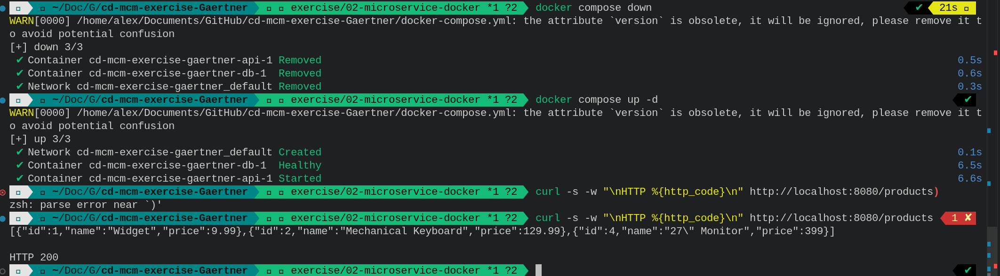

# Docker

This file explains the [Dockerfile](./Dockerfile).

## Dockerfile explained

The Dockerfile is split into two stages. Stage one uses a bigger image `golang:1.26-alpine` to server as a builder. 
The first step simply downloads dependencies and builds the binary.
The second stage uses a smaller image ` alpine:3.19` runs the binary and exposes port 8080.

The reason for using two stages is simple. For running the application only the binary is needed. With the two stage approach the final image size is much lower then in a single stage approach!

## What does CGO_ENABLED=0 do?

CGO_ENABLED enables go to dynamically link binaries. Meaning that the binary is smaller as it expects certain libraries to exist on the host OS.
When disabling it we force go to build a fully static binary. Since we have different images between build and runtime stage we need a fully selfcontained binary. Since only go packages are used in the application anyways there is no downside to disabling CSG_ENABLE.

## Size difference between 2 stage and 1 stage

2 stage: ~29MB

1 stage: ~500MB

### single stage dockerfile

```
FROM golang:1.26-alpine

RUN apk --no-cache add ca-certificates

WORKDIR /app

COPY go.mod go.sum ./
RUN go mod download

COPY . .
RUN CGO_ENABLED=0 GOOS=linux go build -o /api-server ./cmd/api

EXPOSE 8080

ENTRYPOINT ["/api-server"]
```

## Results of CRUD Tests

### Health Check

```
GET /health
→ {"status":"ok"}  HTTP 200
```

### Create 3 Products

```
POST /products  {"name":"Mechanical Keyboard","price":129.99}
→ {"id":2,"name":"Mechanical Keyboard","price":129.99}  HTTP 201

POST /products  {"name":"USB-C Hub","price":49.95}
→ {"id":3,"name":"USB-C Hub","price":49.95}  HTTP 201

POST /products  {"name":"27\" Monitor","price":399.00}
→ {"id":4,"name":"27\" Monitor","price":399}  HTTP 201
```

### List All Products

```
GET /products
→ [
    {"id":1,"name":"Widget","price":9.99},
    {"id":2,"name":"Mechanical Keyboard","price":129.99},
    {"id":3,"name":"USB-C Hub","price":49.95},
    {"id":4,"name":"27\" Monitor","price":399}
  ]  HTTP 200
```

### Update a Product

```
PUT /products/3  {"name":"USB-C Hub Pro","price":79.95}
→ {"id":3,"name":"USB-C Hub Pro","price":79.95}  HTTP 200

GET /products/3
→ {"id":3,"name":"USB-C Hub Pro","price":79.95}  HTTP 200
```

### Delete a Product

```
DELETE /products/3
→ {"result":"success"}  HTTP 200
```

### Verify Deletion

```
GET /products/3
→ {"error":"Product not found"}  HTTP 404

GET /products

→ [
    {"id":1,"name":"Widget","price":9.99},
    {"id":2,"name":"Mechanical Keyboard","price":129.99},
    {"id":4,"name":"27\" Monitor","price":399}
  ]  HTTP 200
```

ID 3 is absent — deletion confirmed.

## Persistency Test



